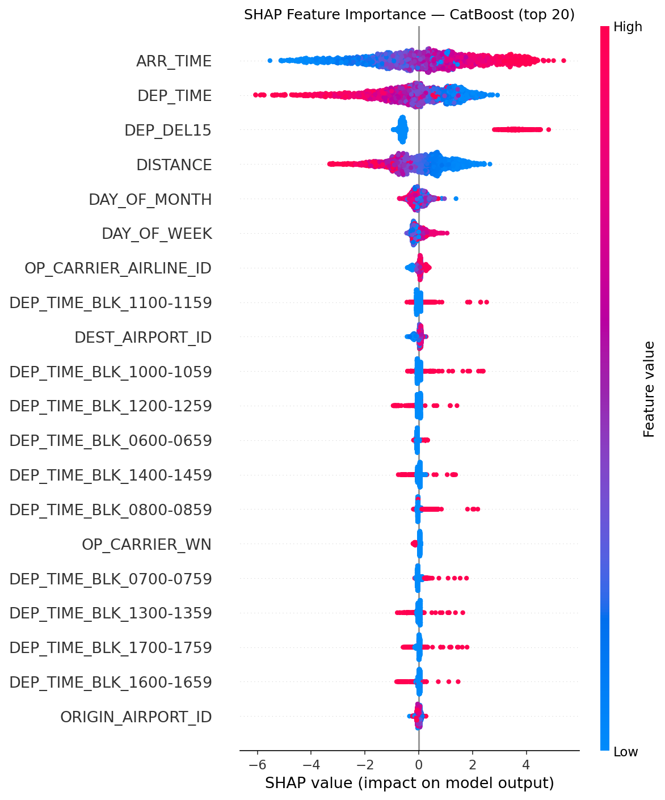
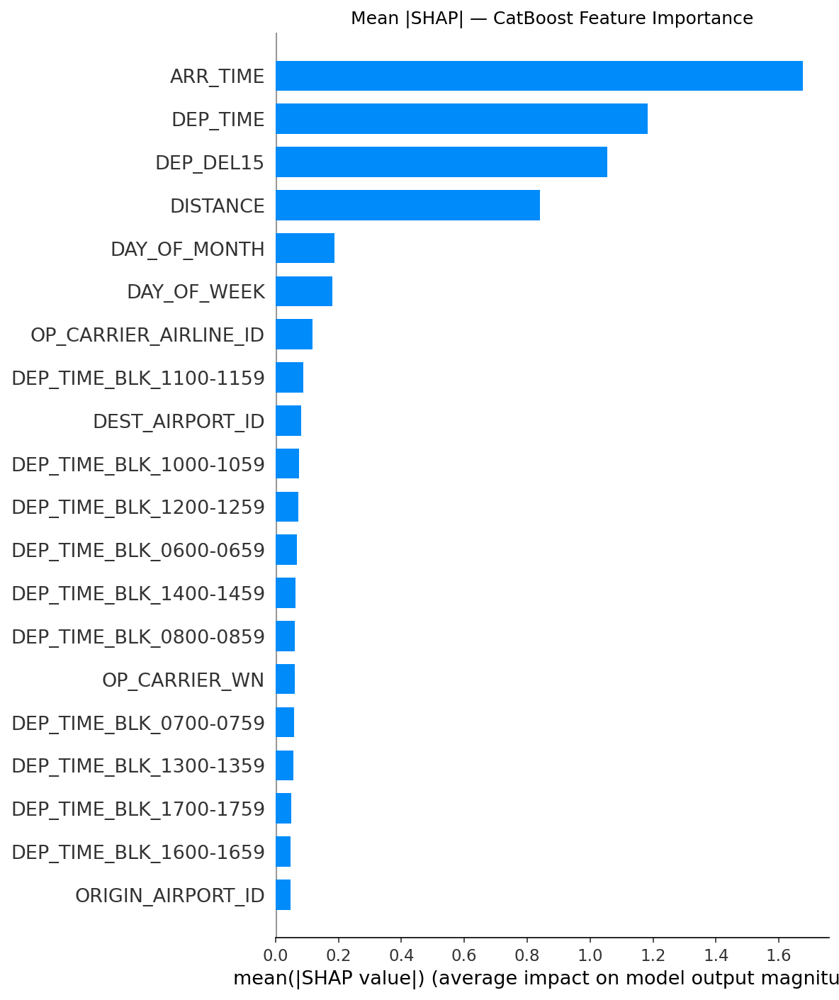

# ✈️ Flight Delay Prediction

A comparative machine learning study predicting whether a US domestic flight will arrive **15 or more minutes late**, using January 2020 BTS On-Time Performance data (~450k flights). Three classifiers are benchmarked — Logistic Regression, Random Forest, and CatBoost — with SHAP analysis to explain what the winning model has learned.

---

## Results

| Model | Accuracy | CV Accuracy | Precision | Recall | F1 | AUC |
|---|---|---|---|---|---|---|
| Logistic Regression | 92.56% | 92.56% | 71.80% | 75.41% | 73.56% | 0.8965 |
| Random Forest | 92.46% | 92.57% | 83.54% | 56.14% | 67.15% | 0.9215 |
| **CatBoost** | **94.18%** | 94.14% | 84.09% | 71.09% | 77.04% | **0.9588** |

> **CatBoost is the clear winner by AUC.** Accuracy alone is misleading given the class imbalance (~79% on-time flights) — AUC and the confusion matrix breakdown tell the real story.

---

## Key Findings

**CatBoost achieves AUC 0.96**, significantly outperforming both baselines. Its gradient boosting approach captures the non-linear interactions between carrier, route, and departure time that a linear model cannot.

**Departure delay is the strongest predictor**, as revealed by SHAP analysis — a flight already running late is very likely to arrive late. Beyond that, departure time block and route history are the next most informative signals.

**Class imbalance was addressed** using `class_weight='balanced'` on Logistic Regression and Random Forest. CatBoost handles imbalance implicitly through its loss function.

**False negatives matter more than false positives** in this domain. Missing a genuine delay is more costly than a false alarm — CatBoost's confusion matrix reflects this with a better recall profile than Random Forest, which aggressively minimises false positives at the cost of missing real delays.

---

## SHAP Analysis

SHAP (SHapley Additive exPlanations) values are used to explain CatBoost's predictions globally. The beeswarm plot shows the distribution of each feature's impact across 2,000 test samples; the bar chart ranks features by mean absolute SHAP value.




---

## Project Structure

```
Predicting-flight-delays/
│
├── notebook/
│   └── flight_delay_prediction.ipynb
│
├── images/
│   ├── shap_summary.png
│   └── shap_bar.png
│
└── README.md
```

---

## Data

Download the dataset from the [BTS On-Time Performance portal](https://www.transtats.bts.gov/DL_SelectFields.aspx?gnoyr_VQ=FGJ). Select January 2020 and place the file as `notebook/jan_2020_ontime.csv` before running the notebook.

The raw data file is excluded from this repository via `.gitignore`.

---

## Setup

```bash
pip install numpy pandas matplotlib scikit-learn catboost shap
```

Then open and run `notebook/flight_delay_prediction.ipynb` top to bottom.

---

## Methodology

- **Preprocessing:** One-Hot Encoding for categorical features (carrier, origin, destination, departure time block); StandardScaler for numeric features; stratified 80/20 train/test split
- **Class imbalance:** `class_weight='balanced'` for LR and RF; implicit handling in CatBoost
- **Evaluation:** Accuracy, 10-fold cross-validation, Precision, Recall, F1, AUC-ROC, Confusion Matrix
- **Explainability:** SHAP TreeExplainer on CatBoost (beeswarm + bar chart)
